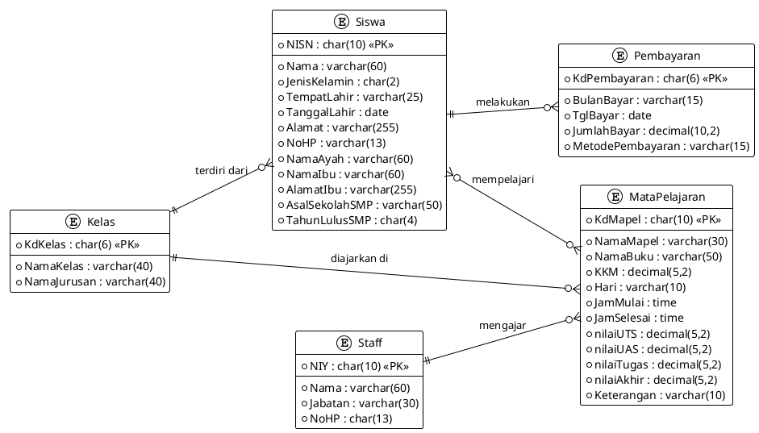
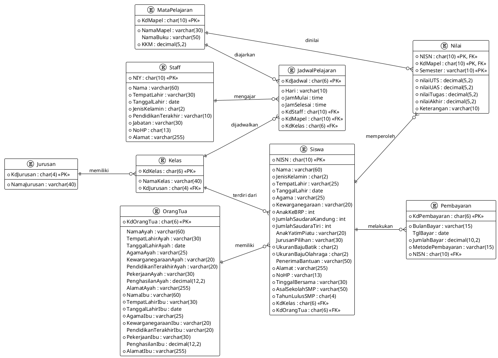

# LAPORAN UAS PROJECT
## BASIS DATA TERAPAN

---

**ANGGOTA KELOMPOK:**
* **Kurniawan** - 2428240159 (Kontribusi: 25%)
* **F.X. Paber Bambang Silalahi** - 2428240123 (Kontribusi: 25%)
* **Thoha Uzair Al-Hamdani** - 2428240147 (Kontribusi: 25%)
* **Abi Ath Thaariq R** - 2428240161 (Kontribusi: 25%)

**DOSEN MATA KULIAH:**
**Diana Putri, S.Si., M.T.**

**PROGRAM STUDI SISTEM INFORMASI**
**FAKULTAS ILMU KOMPUTER DAN REKAYASA**
**UNIVERSITAS MULTI DATA PALEMBANG**
**GENAP 2026**

---

## KATA PENGANTAR

Puji syukur ke hadirat Tuhan Yang Maha Esa atas rahmat-Nya, sehingga laporan ini dapat diselesaikan dengan baik. Laporan ini disusun sebagai bagian dari Ujian Akhir Semester mata kuliah Basis Data Terapan, dengan fokus pada analisis dan perancangan sistem basis data untuk **SMK Gajah Mada 3 Palembang**.

Penulis mengucapkan terima kasih kepada:
1) Ibu Diana Putri, S.Si., M.T., selaku dosen mata kuliah Basis Data Terapan yang telah memberikan bimbingan dan arahan selama proses penyusunan laporan ini.
2) Seluruh anggota kelompok yang telah bekerja sama dengan baik dalam menyelesaikan proyek ini.

Laporan ini bertujuan untuk memberikan gambaran mengenai perancangan sistem basis data akademik yang mendukung proses bisnis di SMK Gajah Mada 3 Palembang, mencakup pendaftaran siswa baru, pendataan orang tua, pengelolaan data guru (staff), penjadwalan kelas, rekap nilai siswa bulanan/UTS/UAS, dan kartu iuran wajib siswa (pembayaran SPP). Selain itu, laporan ini juga menyajikan transformasi dari Entity Relationship Diagram (ERD) ke dalam bentuk tabel serta implementasi skema database di MySQL dan MongoDB.

Penulis berharap laporan ini dapat memberikan manfaat sebagai referensi dalam pengembangan sistem basis data akademik yang efektif dan efisien di bidang pendidikan kejuruan.

---

## DAFTAR ISI
1. BAB I PENDAHULUAN
   * 1.1 Latar Belakang
   * 1.2 Profil Organisasi
   * 1.3 Proses Bisnis & Kebutuhan Data
2. BAB II ISI
   * 2.1 Rancangan Entity Relationship Diagram (ERD)
     * 2.1.1 ERD Sebelum Transformasi (Konseptual - 8 Entitas)
     * 2.1.2 ERD Setelah Transformasi & Normalisasi (Fisik - 9 Entitas)
   * 2.2 Hasil Transformasi ERD Ke Dalam Bentuk Tabel
   * 2.3 Rancangan Tabel Dengan Nama Tabel Dilengkapi Tipe Dan Panjang Datanya
   * 2.4 Tangkapan Layar Skema Database
   * 2.5 Tangkapan Layar Masing-Masing Tabel
   * 2.6 Tangkapan Layar Seluruh Collection Di Mongodb
   * 2.7 Tangkapan Layar Berisi Document Di Masing Masing Collection Di Mongodb
   * 2.8 Tangkapan Layar Hasil Query Di Mysql
   * 2.9 Tangkapan Layar Hasil Query Di Mongodb
3. LAMPIRAN
4. PEMBAGIAN TUGAS

---

## BAB I PENDAHULUAN

### 1.1 Latar Belakang
Perkembangan teknologi informasi saat ini menuntut institusi pendidikan, termasuk sekolah kejuruan, untuk beralih dari pencatatan manual ke sistem manajemen basis data yang terkomputerisasi. Untuk memenuhi tugas mata kuliah Basis Data Terapan di Universitas Multi Data Palembang, Kelompok 4 melakukan analisis terhadap alur administrasi dan data akademik di SMK Gajah Mada 3 Palembang. Berdasarkan hasil analisis tersebut, kami merancang basis data relasional (MySQL) dan non-relasional (MongoDB) untuk mendukung kelancaran administrasi sekolah kejuruan ini.

### 1.2 Profil Organisasi
* **Nama Organisasi**: SMK Gajah Mada 3 Palembang
* **Akreditasi / Yayasan**: Akreditasi B di bawah naungan Yayasan Sumber Agung
* **Alamat**: Jl. K.H. Wahid Hasyim RT 11, 1 Ulu, Kec. Seberang Ulu I, Kota Palembang, Sumatera Selatan
* **Fokus Kejuruan**: Mencetak lulusan siap kerja di bidang teknologi dan ekonomi, dengan program utama seperti Akuntansi (AK), Manajemen Perkantoran (MP), Teknik Kendaraan Ringan (TKR), dan Teknik Komputer Jaringan (TKJ).

### 1.3 Proses Bisnis & Kebutuhan Data
Administrasi sekolah kejuruan ini memiliki empat alur utama yang membutuhkan integrasi data:
1. **Administrasi Siswa Baru (Pendaftaran)**: Siswa mengisi formulir fisik dan mengumpulkan data pribadi serta data orang tua/wali dan asal SMP mereka. Calon siswa yang dinyatakan lolos langsung dimasukkan ke dalam kelas tertentu.
2. **Proses Penjadwalan & Belajar Mengajar**: Sekolah memetakan daftar staff pengajar (Guru), ruang kelas, dan mata pelajaran yang diajarkan demi mewujudkan jadwal pelajaran per semester.
3. **Pembayaran Iuran Bulanan (Kartu SPP)**: Setiap siswa wajib membayar iuran SPP bulanan sebesar Rp. 150.000,00 yang diverifikasi oleh Bendahara berdasarkan bulan pembayaran, tanggal transaksi, nominal, dan metode pembayaran.
4. **Proses Evaluasi Akademik (Penilaian)**: Siswa dinilai pada setiap semester melalui komponen nilai UTS, nilai UAS, dan nilai Tugas. Komponen ini dihitung untuk menghasilkan Nilai Akhir penentu kelulusan KKM.

---

## BAB II ISI

### 2.1 Rancangan Entity Relationship Diagram (ERD)

#### 2.1.1 ERD Sebelum Transformasi (Konseptual - 5 Entitas)
Pada rancangan awal (model konseptual sebelum transformasi dan normalisasi), entitas dibuat seminimal mungkin dengan menggabungkan beberapa relasi fisik yang belum dinormalisasi:
1. Data **OrangTua** digabungkan langsung sebagai atribut di dalam entitas **Siswa**.
2. Data **Jurusan** digabungkan langsung ke dalam entitas **Kelas** (NamaJurusan disimpan langsung di Kelas).
3. Data **JadwalPelajaran** dan komponen **Nilai** digabungkan langsung ke dalam entitas **MataPelajaran** (menyimpan info jadwal, pengajar, KKM, serta nilai akademik secara denormalisasi).

Hal ini dirancang untuk memudahkan pemahaman konseptual alur data sekolah sebelum didekomposisi lebih lanjut.



#### 2.1.2 ERD Setelah Transformasi & Normalisasi (Fisik - 9 Entitas)
Setelah dilakukan proses transformasi relasi dan normalisasi (hingga bentuk 3NF), model fisik didekomposisi menjadi **9 entitas** terpisah guna menghindari redundansi data dan *anomaly* pengeditan:
1. Atribut keluarga dipisah menjadi entitas **OrangTua** untuk mencegah duplikasi data orang tua pada siswa yang bersaudara kandung (relasi One-to-Many).
2. Nama kejuruan dipisah menjadi entitas **Jurusan** untuk efisiensi penyimpanan nama jurusan yang berulang di banyak tingkat kelas.
3. Hubungan banyak-ke-banyak antara Kelas, Staff (Guru), dan MataPelajaran dinormalisasi dengan mengekstrak entitas **JadwalPelajaran**.
4. Hubungan nilai akademik dipisah menjadi entitas asosiatif **Nilai** yang menghubungkan Siswa dan MataPelajaran per semester secara unik.



---

### 2.2 Hasil Transformasi ERD Ke Dalam Bentuk Tabel
Transformasi model konseptual menghasilkan **9 tabel fisik** yang saling berelasi:
1. `Jurusan`: Data master program kejuruan SMK.
2. `Kelas`: Tingkat dan ruang kelas siswa kejuruan.
3. `OrangTua`: Profil ayah & ibu kandung/wali siswa. Relasi `OrangTua` dan `Siswa` bertipe **One-to-Many (1 ke N)**, yang artinya satu data OrangTua dapat dimiliki oleh lebih dari satu siswa (bersaudara kandung).
4. `Siswa`: Data pribadi detail siswa yang terikat dengan kelas dan data orang tua/keluarganya.
5. `Staff`: Data master guru pengampu dan staf sekolah.
6. `MataPelajaran`: Nama mapel wajib kejuruan beserta target KKM.
7. `JadwalPelajaran`: Relasi penugasan guru mengajar mata pelajaran tertentu di kelas tertentu.
8. `Pembayaran`: Transaksi pembayaran SPP bulanan per siswa.
9. `Nilai`: Hasil akumulasi evaluasi nilai UTS, UAS, Tugas, dan Nilai Akhir per mapel per semester.

---

### 2.3 Rancangan Tabel Dengan Nama Tabel Dilengkapi Tipe Dan Panjang Datanya

#### 1. Tabel: `Jurusan`
| Nama Field | Tipe Data | Panjang | Keterangan |
| :--- | :--- | :--- | :--- |
| `KdJurusan` (PK) | CHAR | 4 | Kode unik program kejuruan |
| `NamaJurusan` | VARCHAR | 40 | Nama lengkap kejuruan |

#### 2. Tabel: `Kelas`
| Nama Field | Tipe Data | Panjang | Keterangan |
| :--- | :--- | :--- | :--- |
| `KdKelas` (PK) | CHAR | 6 | Kode tingkat + singkatan kelas |
| `NamaKelas` | VARCHAR | 40 | Deskripsi nama kelas lengkap |
| `KdJurusan` (FK) | CHAR | 4 | Referensi ke tabel `Jurusan` |

#### 3. Tabel: `OrangTua`
| Nama Field | Tipe Data | Panjang | Keterangan |
| :--- | :--- | :--- | :--- |
| `KdOrangTua` (PK) | CHAR | 6 | Kode unik data keluarga/orang tua |
| `NamaAyah` | VARCHAR | 60 | Nama lengkap ayah kandung |
| `TempatLahirAyah` | VARCHAR | 30 | Tempat lahir ayah |
| `TanggalLahirAyah` | DATE | - | Tanggal lahir ayah |
| `AgamaAyah` | VARCHAR | 25 | Agama ayah |
| `KewarganegaraanAyah` | VARCHAR | 20 | Kewarganegaraan ayah |
| `PendidikanTerakhirAyah` | VARCHAR | 20 | Pendidikan terakhir ayah |
| `PekerjaanAyah` | VARCHAR | 30 | Pekerjaan ayah |
| `PenghasilanAyah` | DECIMAL | 12,2 | Penghasilan bulanan ayah |
| `AlamatAyah` | VARCHAR | 255 | Alamat tinggal ayah |
| `NamaIbu` | VARCHAR | 60 | Nama lengkap ibu kandung |
| `TempatLahirIbu` | VARCHAR | 30 | Tempat lahir ibu |
| `TanggalLahirIbu` | DATE | - | Tanggal lahir ibu |
| `AgamaIbu` | VARCHAR | 25 | Agama ibu |
| `KewarganegaraanIbu` | VARCHAR | 20 | Kewarganegaraan ibu |
| `PendidikanTerakhirIbu` | VARCHAR | 20 | Pendidikan terakhir ibu |
| `PekerjaanIbu` | VARCHAR | 30 | Pekerjaan ibu |
| `PenghasilanIbu` | DECIMAL | 12,2 | Penghasilan bulanan ibu |
| `AlamatIbu` | VARCHAR | 255 | Alamat tinggal ibu |

#### 4. Tabel: `Siswa`
| Nama Field | Tipe Data | Panjang | Keterangan |
| :--- | :--- | :--- | :--- |
| `Nama` | VARCHAR | 60 | Nama lengkap siswa |
| `NISN` (PK) | CHAR | 10 | Nomor Induk Siswa Nasional |
| `JenisKelamin` | CHAR | 2 | Jenis kelamin siswa (L/P) |
| `TempatLahir` | VARCHAR | 25 | Tempat lahir siswa |
| `TanggalLahir` | DATE | - | Tanggal lahir siswa |
| `Agama` | VARCHAR | 25 | Agama siswa |
| `Kewarganegaraan` | VARCHAR | 20 | Kewarganegaraan siswa |
| `AnakKeBRP` | INT | - | Urutan kelahiran siswa |
| `JumlahSaudaraKandung` | INT | - | Jumlah saudara kandung |
| `JumlahSaudaraTiri` | INT | - | Jumlah saudara tiri |
| `AnakYatimPiatu` | VARCHAR | 20 | Status anak yatim/piatu |
| `JurusanPilihan` | VARCHAR | 30 | Jurusan pilihan pendaftaran |
| `UkuranBajuBatik` | CHAR | 2 | Ukuran baju batik siswa |
| `UkuranBajuOlahraga` | CHAR | 2 | Ukuran baju olahraga siswa |
| `PenerimaBantuan` | VARCHAR | 50 | Keterangan bantuan (e.g. PIP) |
| `Alamat` | VARCHAR | 255 | Alamat tinggal siswa |
| `NoHP` | VARCHAR | 13 | Nomor telepon seluler siswa |
| `TinggalBersama` | VARCHAR | 30 | Tinggal bersama siapa |
| `AsalSekolahSMP` | VARCHAR | 50 | Nama sekolah SMP/MTs asal |
| `TahunLulusSMP` | CHAR | 4 | Tahun kelulusan SMP |
| `KdKelas` (FK) | CHAR | 6 | Referensi ke tabel `Kelas` |
| `KdOrangTua` (FK) | CHAR | 6 | Referensi ke tabel `OrangTua` |

#### 5. Tabel: `Staff`
| Nama Field | Tipe Data | Panjang | Keterangan |
| :--- | :--- | :--- | :--- |
| `NIY` (PK) | CHAR | 10 | Nomor Induk Yayasan (Pegawai) |
| `Nama` | VARCHAR | 60 | Nama staff lengkap dengan gelar |
| `TempatLahir` | VARCHAR | 30 | Tempat lahir staff |
| `TanggalLahir` | DATE | - | Tanggal lahir staff |
| `JenisKelamin` | CHAR | 2 | Jenis kelamin staff (L/P) |
| `PendidikanTerakhir` | VARCHAR | 10 | Pendidikan terakhir staff |
| `Jabatan` | VARCHAR | 30 | Jabatan staff di sekolah |
| `NoHP` | CHAR | 13 | Nomor HP aktif staff |
| `Alamat` | VARCHAR | 255 | Alamat tinggal staff |

#### 6. Tabel: `MataPelajaran`
| Nama Field | Tipe Data | Panjang | Keterangan |
| :--- | :--- | :--- | :--- |
| `KdMapel` (PK) | CHAR | 10 | Kode unik mata pelajaran |
| `NamaMapel` | VARCHAR | 30 | Nama lengkap mata pelajaran |
| `NamaBuku` | VARCHAR | 50 | Judul buku pegangan mata pelajaran |
| `KKM` | DECIMAL | 5,2 | Batas nilai KKM kelulusan |

#### 7. Tabel: `JadwalPelajaran`
| Nama Field | Tipe Data | Panjang | Keterangan |
| :--- | :--- | :--- | :--- |
| `KdJadwal` (PK) | CHAR | 6 | Kode unik jadwal mengajar |
| `Hari` | VARCHAR | 10 | Hari pelaksanaan belajar-mengajar |
| `JamMulai` | TIME | - | Waktu kelas dimulai |
| `JamSelesai` | TIME | - | Waktu kelas berakhir |
| `KdStaff` (FK) | CHAR | 10 | Referensi ke NIY guru di tabel Staff |
| `KdMapel` (FK) | CHAR | 10 | Referensi ke KdMapel di tabel MataPelajaran |
| `KdKelas` (FK) | CHAR | 6 | Referensi ke KdKelas di tabel Kelas |

#### 8. Tabel: `Pembayaran`
| Nama Field | Tipe Data | Panjang | Keterangan |
| :--- | :--- | :--- | :--- |
| `KdPembayaran` (PK) | CHAR | 6 | Kode transaksi pembayaran SPP |
| `BulanBayar` | VARCHAR | 15 | Keterangan bulan SPP (e.g. Juli 2026) |
| `TglBayar` | DATE | - | Tanggal pembayaran dilakukan |
| `JumlahBayar` | DECIMAL | 10,2 | Nominal bayar SPP (Rp. 150.000,00) |
| `MetodePembayaran` | VARCHAR | 15 | Metode bayar (Tunai, Transfer) |
| `NISN` (FK) | CHAR | 10 | Referensi ke NISN di tabel Siswa |

#### 9. Tabel: `Nilai`
| Nama Field | Tipe Data | Panjang | Keterangan |
| :--- | :--- | :--- | :--- |
| `NISN` (PK, FK) | CHAR | 10 | Referensi ke NISN di tabel Siswa |
| `KdMapel` (PK, FK) | CHAR | 10 | Referensi ke KdMapel di tabel MataPelajaran |
| `Semester` (PK) | VARCHAR | 10 | Semester akademik (Ganjil/Genap) |
| `nilaiUTS` | DECIMAL | 5,2 | Komponen nilai Ujian Tengah Semester |
| `nilaiUAS` | DECIMAL | 5,2 | Komponen nilai Ujian Akhir Semester |
| `nilaiTugas` | DECIMAL | 5,2 | Komponen nilai Tugas mandiri/kelompok |
| `nilaiAkhir` | DECIMAL | 5,2 | Nilai akhir (30% Tugas + 30% UTS + 40% UAS) |
| `Keterangan` | VARCHAR | 10 | Status ketercapaian (Tuntas, Remedial) |

---

### 2.4 Tangkapan Layar Skema Database
*(Skema database relasional 9 tabel diekspor dari MySQL Workbench EER Diagram)*

> **[TEMPATKAN SCREENSHOT REVERSE ENGINEERING DIAGRAM RELASI MYSQL DISINI]**

---

### 2.5 Tangkapan Layar Masing-Masing Tabel (10 Data per Tabel)
*(Jalankan perintah `SELECT * FROM [nama_tabel];` di MySQL Workbench lalu screenshot hasilnya di bagian Output Grid)*

* **Tabel Jurusan**  
  > **[TEMPATKAN SCREENSHOT DATA TABEL JURUSAN DISINI]**
* **Tabel Kelas**  
  > **[TEMPATKAN SCREENSHOT DATA TABEL KELAS DISINI]**
* **Tabel OrangTua**  
  > **[TEMPATKAN SCREENSHOT DATA TABEL ORANGTUA DISINI]**
* **Tabel Siswa**  
  > **[TEMPATKAN SCREENSHOT DATA TABEL SISWA DISINI]**
* **Tabel Staff**  
  > **[TEMPATKAN SCREENSHOT DATA TABEL STAFF DISINI]**
* **Tabel MataPelajaran**  
  > **[TEMPATKAN SCREENSHOT DATA TABEL MATAPELAJARAN DISINI]**
* **Tabel JadwalPelajaran**  
  > **[TEMPATKAN SCREENSHOT DATA TABEL JADWALPELAJARAN DISINI]**
* **Tabel Pembayaran**  
  > **[TEMPATKAN SCREENSHOT DATA TABEL PEMBAYARAN DISINI]**
* **Tabel Nilai**  
  > **[TEMPATKAN SCREENSHOT DATA TABEL NILAI DISINI]**

---

### 2.6 Tangkapan Layar Seluruh Collection Di Mongodb
*(Daftar 9 collections yang terbentuk di dalam database `sistem_akademik_smk` pada MongoDB Compass)*

> **[TEMPATKAN SCREENSHOT DAFTAR 9 COLLECTIONS MONGODB DISINI]**

---

### 2.7 Tangkapan Layar Berisi Document Di Masing Masing Collection Di Mongodb
*(Isi masing-masing collection di MongoDB Compass pada tab Documents)*

* **Collection Jurusan**  
  > **[TEMPATKAN SCREENSHOT DOKUMEN JURUSAN DISINI]**
* **Collection Kelas**  
  > **[TEMPATKAN SCREENSHOT DOKUMEN KELAS DISINI]**
* **Collection OrangTua**  
  > **[TEMPATKAN SCREENSHOT DOKUMEN ORANGTUA DISINI]**
* **Collection Siswa**  
  > **[TEMPATKAN SCREENSHOT DOKUMEN SISWA DISINI]**
* **Collection Staff**  
  > **[TEMPATKAN SCREENSHOT DOKUMEN STAFF DISINI]**
* **Collection MataPelajaran**  
  > **[TEMPATKAN SCREENSHOT DOKUMEN MATAPELAJARAN DISINI]**
* **Collection JadwalPelajaran**  
  > **[TEMPATKAN SCREENSHOT DOKUMEN JADWALPELAJARAN DISINI]**
* **Collection Pembayaran**  
  > **[TEMPATKAN SCREENSHOT DOKUMEN PEMBAYARAN DISINI]**
* **Collection Nilai**  
  > **[TEMPATKAN SCREENSHOT DOKUMEN NILAI DISINI]**

---

### 2.8 Tangkapan Layar Hasil Query Di Mysql

#### A. Kurniawan (2428240159)
1. **Query Select-Join-Fungsi** (Menampilkan data siswa, kelas, dan jurusan khusus untuk jurusan Teknik Kendaraan Ringan diurutkan dari nama alfabetis).
   ```sql
   select Siswa.NISN, upper(Siswa.Nama) as 'Nama Siswa', Alamat, NamaKelas, NamaJurusan
   from Siswa
   join Kelas on Siswa.KdKelas = Kelas.KdKelas
   join Jurusan on Kelas.KdJurusan = Jurusan.KdJurusan
   where NamaJurusan = 'Teknik Kendaraan Ringan'
   order by Siswa.Nama asc;
   ```
   * **Manfaat & Cara Kerja**: Query ini bermanfaat bagi Kepala Jurusan Teknik Kendaraan Ringan (TKR) untuk menarik daftar siswa aktif secara alfabetis guna keperluan koordinasi praktikum, pembagian seragam, atau penempatan bengkel. Cara kerjanya adalah dengan menggabungkan tabel `Siswa`, `Kelas`, dan `Jurusan` menggunakan relasi kode kelas dan jurusan, memfilter hanya yang jurusannya bernilai "Teknik Kendaraan Ringan", mengubah huruf nama menjadi kapital dengan fungsi `upper` untuk keperluan standar dokumen, dan mengurutkannya dari A-Z (`asc`).
   > **[TEMPATKAN SCREENSHOT HASIL SELECT-JOIN KURNIAWAN DISINI]**
2. **Query View** (`view_siswa_jurusan_tkr`)
   ```sql
   select * from view_siswa_jurusan_tkr;
   ```
   * **Manfaat & Cara Kerja**: View ini bermanfaat bagi para guru mata pelajaran produktif TKR untuk mengakses data dasar siswa kelasnya secara instan tanpa perlu menulis ulang query join yang rumit. Selain itu, view ini menyembunyikan kolom sensitif seperti nomor HP dan detail orang tua siswa untuk keamanan data. Cara kerjanya adalah dengan memanggil tabel virtual `view_siswa_jurusan_tkr` yang secara otomatis menjalankan query join terfilter di latar belakang.
   > **[TEMPATKAN SCREENSHOT HASIL VIEW KURNIAWAN DISINI]**
3. **Query Stored Procedure** (`GetSiswaByJurusan`)
   ```sql
   call GetSiswaByJurusan('Akuntansi');
   ```
   * **Manfaat & Cara Kerja**: Prosedur ini sangat membantu staf Tata Usaha (TU) untuk menyaring daftar siswa berdasarkan jurusan apa pun secara dinamis ketika masa daftar ulang atau pembagian kelompok kelas. Cara kerjanya adalah menerima parameter nama jurusan (misal `'Akuntansi'`), lalu mencocokkan kolom nama jurusan dengan parameter input tersebut untuk menyajikan datanya.
   > **[TEMPATKAN SCREENSHOT HASIL STORED PROCEDURE KURNIAWAN DISINI]**

#### B. F.X. Paber Bambang Silalahi (2428240123)
1. **Query Select-Join-Fungsi** (Menampilkan data pembayaran SPP siswa yang membayar pada rentang tanggal tertentu di bulan Juli 2026).
   ```sql
   select distinct Siswa.NISN, Siswa.Nama as 'Nama Siswa', TglBayar, JumlahBayar, MetodePembayaran
   from Siswa
   join Pembayaran on Siswa.NISN = Pembayaran.NISN
   where TglBayar between '2026-07-01' and '2026-07-30'
   order by TglBayar asc;
   ```
   * **Manfaat & Cara Kerja**: Query ini sangat penting bagi Bendahara Sekolah dalam melakukan pembukuan harian SPP dan memantau realisasi pembayaran siswa pada bulan Juli 2026 demi kelancaran arus kas operasional. Cara kerjanya adalah menghubungkan tabel `Siswa` dan `Pembayaran` berdasarkan NISN, menyaring transaksi yang memiliki tanggal pembayaran antara tanggal 1 hingga 30 Juli 2026 menggunakan operator `between`, membuang duplikasi jika ada transaksi pembayaran ganda dengan `distinct`, lalu mengurutkan hasilnya secara kronologis menaik (`asc`).
   > **[TEMPATKAN SCREENSHOT HASIL SELECT-JOIN F.X. PABER DISINI]**
2. **Query View** (`view_rekap_pembayaran`)
   ```sql
   select * from view_rekap_pembayaran;
   ```
   * **Manfaat & Cara Kerja**: View ini bermanfaat bagi Keuangan Sekolah untuk mengukur total akumulasi dana SPP yang telah terkumpul serta frekuensi transaksi pembayaran yang dilakukan oleh setiap siswa. Cara kerjanya adalah mengelompokkan data pembayaran yang telah terealisasi (`TglBayar is not null`) berdasarkan siswa, menjumlahkan nominal bayar menggunakan fungsi agregat `sum`, dan menghitung jumlah transaksi per siswa menggunakan `count`.
   > **[TEMPATKAN SCREENSHOT HASIL VIEW F.X. PABER DISINI]**
3. **Query Stored Procedure** (`GetPembayaranByMetode`)
   ```sql
   call GetPembayaranByMetode('Transfer');
   ```
   * **Manfaat & Cara Kerja**: Prosedur ini memudahkan bagian keuangan untuk mencocokkan laporan bank (rekonsiliasi) secara dinamis sesuai metode pembayaran (misal `'Transfer'` atau `'Tunai'`). Cara kerjanya adalah memfilter rincian pembayaran SPP yang memiliki nilai kolom `MetodePembayaran` sesuai dengan nilai parameter yang dimasukkan oleh pengguna saat prosedur dipanggil.
   > **[TEMPATKAN SCREENSHOT HASIL STORED PROCEDURE F.X. PABER DISINI]**

#### C. Thoha Uzair Al-Hamdani (2428240147)
1. **Query Select-Join-Fungsi** (Menampilkan daftar siswa yang memiliki tunggakan pembayaran SPP pada bulan tertentu).
   ```sql
   select Siswa.NISN, upper(Nama) as 'Nama Siswa', NamaKelas, BulanBayar, MetodePembayaran
   from Siswa
   join Kelas on Siswa.KdKelas = Kelas.KdKelas
   join Pembayaran on Siswa.NISN = Pembayaran.NISN
   where MetodePembayaran = 'BelumBayar'
   order by Nama asc;
   ```
   * **Manfaat & Cara Kerja**: Query ini sangat bermanfaat bagi Bendahara dan Wali Kelas untuk mengidentifikasi siswa yang belum membayar SPP bulanan guna proses penagihan tunggakan atau pengiriman surat pemberitahuan kepada orang tua wali. Cara kerjanya adalah dengan menggabungkan data dari tabel `Siswa`, `Kelas`, dan `Pembayaran`, menyaring data transaksi SPP dengan kriteria `MetodePembayaran` bernilai `'BelumBayar'`, menstandarisasi nama siswa menjadi huruf kapital menggunakan fungsi `upper`, lalu mengurutkan hasilnya berdasarkan nama kelas dan nama siswa secara alfabetis.
   > **[TEMPATKAN SCREENSHOT HASIL SELECT-JOIN THOHA UZAIR DISINI]**
2. **Query View** (`view_daftar_kelulusan_siswa`)
   ```sql
   select * from view_daftar_kelulusan_siswa;
   ```
   * **Manfaat & Cara Kerja**: View ini bermanfaat bagi Waka Kurikulum untuk mendokumentasikan, melacak, dan memverifikasi rekapitulasi nilai akhir mata pelajaran yang diikuti seluruh siswa tingkat akhir (kelas XII) untuk persiapan sidang kelulusan. Cara kerjanya adalah menggabungkan data dari tabel `Siswa`, `Kelas`, `Nilai`, dan `MataPelajaran` untuk menyaring riwayat nilai akhir siswa kelas XII.
   > **[TEMPATKAN SCREENSHOT HASIL VIEW THOHA UZAIR DISINI]**
3. **Query Stored Procedure** (`NaikKelasSiswa`)
   ```sql
   call NaikKelasSiswa('11TKR', '12TKR');
   ```
   * **Manfaat & Cara Kerja**: Prosedur ini sangat penting bagi staf administrasi sekolah (TU) untuk memproses perpindahan rombongan belajar (rombel) siswa secara massal dari kelas lama ke kelas baru saat pergantian tahun ajaran baru. Cara kerjanya adalah menerima parameter kode kelas asal (`kelas_asal`) dan kode kelas tujuan (`kelas_tujuan`), kemudian menjalankan perintah `update` untuk memperbarui atribut `KdKelas` pada seluruh siswa yang terdaftar di kelas asal tersebut.
   > **[TEMPATKAN SCREENSHOT HASIL STORED PROCEDURE THOHA UZAIR DISINI]**

#### D. Abi Ath Thaariq R (2428240161)
1. **Query Select-Join-Fungsi** (Menampilkan data nilai akhir siswa yang sama dengan atau melebihi batas nilai 78.00, diurutkan dari nilai terbesar).
   ```sql
   select distinct Nilai.NISN, Siswa.Nama, NamaMapel, Semester, nilaiAkhir, KKM
   from Nilai
   join Siswa on Nilai.NISN = Siswa.NISN
   join MataPelajaran on Nilai.KdMapel = MataPelajaran.KdMapel
   where nilaiAkhir >= 78.00
   order by nilaiAkhir desc;
   ```
   * **Manfaat & Cara Kerja**: Query ini bermanfaat bagi Wali Kelas dan Kesiswaan untuk mendata siswa berprestasi yang nilainya melampaui batas standar KKM (78.00) guna pengusulan program beasiswa prestasi atau seleksi lomba akademik. Cara kerjanya adalah menghubungkan data nilai dengan nama siswa dan mata pelajaran, memfilter baris yang memiliki `nilaiAkhir` di atas atau sama dengan `78.00`, membuang duplikasi record identik dengan `distinct`, lalu mengurutkannya berdasarkan nilai terbesar ke terkecil (`desc`).
   > **[TEMPATKAN SCREENSHOT HASIL SELECT-JOIN ABI ATH DISINI]**
2. **Query View** (`view_rekap_nilai_siswa`)
   ```sql
   select * from view_rekap_nilai_siswa;
   ```
   * **Manfaat & Cara Kerja**: View ini mempermudah admin kurikulum untuk mengekspor rekapitulasi nilai kumulatif siswa ke dalam format pengisian Raport Digital secara berkala. Cara kerjanya adalah menyatukan atribut NISN, nama siswa, nama mata pelajaran, nilai akhir, KKM, serta keterangan kelulusan dari tabel relasi `Nilai`, `Siswa`, dan `MataPelajaran` ke dalam view terpusat.
   > **[TEMPATKAN SCREENSHOT HASIL VIEW ABI ATH DISINI]**
3. **Query Stored Procedure** (`GetNilaiDiBawahKKM`)
   ```sql
   call GetNilaiDiBawahKKM('M001');
   ```
   * **Manfaat & Cara Kerja**: Prosedur ini sangat berguna bagi guru mata pelajaran untuk mengidentifikasi siswa yang belum tuntas di kelasnya secara cepat untuk didata ke program bimbingan remedial. Cara kerjanya adalah menerima input kode mapel (misalnya `'M001'`), lalu menyaring data siswa yang memiliki nilai akhir di bawah batas KKM mata pelajaran tersebut.
   > **[TEMPATKAN SCREENSHOT HASIL STORED PROCEDURE ABI ATH DISINI]**

---

### 2.9 Tangkapan Layar Hasil Query Di Mongodb

#### A. Kurniawan (2428240159)
1. **Query Selector** (Mencari siswa kelas 11TKR yang bertempat tinggal di Palembang)
   ```javascript
   db.Siswa.find({ $and: [{ "KdKelas": { $eq: "11TKR" } }, { "Alamat": { $regex: /Palembang/i } }] })
   ```
   * **Manfaat & Cara Kerja**: Query ini membantu administrasi sekolah memetakan siswa kelas XI TKR yang berdomisili di Palembang untuk koordinasi lokasi Prakerin (Praktik Kerja Industri) terdekat agar menghemat biaya transport siswa. Cara kerjanya adalah menggunakan operator `$and` untuk memastikan kedua kriteria terpenuhi: field `KdKelas` bernilai `"11TKR"`, dan field `Alamat` mengandung kata `"Palembang"` melalui regex pencarian case-insensitive (`/Palembang/i`).
   > **[TEMPATKAN SCREENSHOT HASIL SELECTOR KURNIAWAN DISINI]**
2. **Query Aggregation** (Menghitung jumlah total siswa per KdKelas)
   ```javascript
   db.Siswa.aggregate([ { $group: { _id: "$KdKelas", total_siswa: { $sum: 1 } } }, { $sort: { total_siswa: -1 } } ])
   ```
   * **Manfaat & Cara Kerja**: Membantu Manajemen Sekolah untuk memantau beban kelas secara real-time guna evaluasi pemanfaatan ruang belajar dan kebutuhan rasio guru terhadap siswa. Cara kerjanya adalah tahap `$group` mengelompokkan dokumen berdasarkan field `KdKelas` dan menghitung jumlahnya via `{ $sum: 1 }`, kemudian tahap `$sort` mengurutkan dari kelas terpadat ke terjarang (`-1`).
   > **[TEMPATKAN SCREENSHOT HASIL AGGREGATION KURNIAWAN DISINI]**

#### B. F.X. Paber Bambang Silalahi (2428240123)
1. **Query Selector** (Mencari transaksi iuran SPP bernilai >= Rp 150.000 dengan Metode Transfer)
   ```javascript
   db.Pembayaran.find({ $and: [{ "JumlahBayar": { $gte: 150000 } }, { "MetodePembayaran": { $eq: "Transfer" } }] })
   ```
   * **Manfaat & Cara Kerja**: Berguna bagi staf Keuangan Sekolah untuk merekonsiliasi transaksi SPP non-tunai bernilai penuh (Rp 150.000 ke atas) yang ditransfer via bank dengan data mutasi rekening koran sekolah. Cara kerjanya adalah mencocokkan dokumen pembayaran SPP yang memenuhi kriteria `$and` dari field `JumlahBayar` bernilai `>= 150.000` (`$gte`) dan field `MetodePembayaran` bernilai eksak `"Transfer"` (`$eq`).
   > **[TEMPATKAN SCREENSHOT HASIL SELECTOR F.X. PABER DISINI]**
2. **Query Aggregation** (Menghitung total pembayaran SPP berdasarkan metode pembayaran)
   ```javascript
   db.Pembayaran.aggregate([ { $group: { _id: "$MetodePembayaran", total_pembayaran: { $sum: "$JumlahBayar" } } } ])
   ```
   * **Manfaat & Cara Kerja**: Membantu Kepala Sekolah/Yayasan mengevaluasi metode pembayaran SPP yang paling diminati orang tua siswa demi pengembangan digitalisasi sistem pembayaran sekolah. Cara kerjanya adalah mengelompokkan data berdasarkan field `MetodePembayaran` lalu menjumlahkan field `JumlahBayar` dari setiap kelompok tersebut menggunakan fungsi `{ $sum: "$JumlahBayar" }`.
   > **[TEMPATKAN SCREENSHOT HASIL AGGREGATION F.X. PABER DISINI]**

#### C. Thoha Uzair Al-Hamdani (2428240147)
1. **Query Selector** (Mencari siswa kelas X/tingkat awal yang terdata sebagai penerima bantuan sekolah)
   ```javascript
   db.Siswa.find({ $and: [{ "KdKelas": { $regex: /^10/ } }, { "PenerimaBantuan": { $ne: null } }] })
   ```
   * **Manfaat & Cara Kerja**: Query ini membantu administrasi sekolah dan staf kesiswaan menyaring secara instan daftar siswa baru (kelas X) yang berhak menerima pencairan bantuan dana pendidikan (seperti PIP). Cara kerjanya adalah dengan mencocokkan dokumen pada collection `Siswa` menggunakan operator logika `$and`, di mana field `KdKelas` dicocokkan dengan ekspresi reguler `/^10/` (diawali angka 10) dan field `PenerimaBantuan` dipastikan tidak bernilai kosong atau null (`$ne: null`).
   > **[TEMPATKAN SCREENSHOT HASIL SELECTOR THOHA UZAIR DISINI]**
2. **Query Aggregation** (Menghitung rata-rata nilai akhir siswa per mata pelajaran dengan pembulatan)
   ```javascript
   db.Nilai.aggregate([
     { $group: { _id: "$KdMapel", rata_nilai_raw: { $avg: "$nilaiAkhir" } } },
     { $project: { _id: 1, rata_nilai: { $round: ["$rata_nilai_raw", 2] } } },
     { $sort: { rata_nilai: -1 } }
   ])
   ```
   * **Manfaat & Cara Kerja**: Agregasi ini sangat berguna bagi Waka Kurikulum untuk memantau performa rata-rata nilai akhir akademik siswa pada masing-masing mata pelajaran secara rapi guna keperluan evaluasi mutu pembelajaran. Cara kerjanya terdiri dari 3 tahapan:
     1. **`$group`**: Mengelompokkan dokumen Nilai berdasarkan `KdMapel` dan menghitung rata-rata nilai akhir mentah menggunakan operator agregasi `$avg` disimpan di field `rata_nilai_raw`.
     2. **`$project`**: Melakukan pemilihan field serta menerapkan operasi matematika **`$round`** untuk membulatkan nilai rata-rata mentah menjadi maksimal 2 angka di belakang koma (field `rata_nilai`).
     3. **`$sort`**: Mengurutkan hasil akhir dari rata-rata nilai tertinggi ke terendah (`-1`).
   > **[TEMPATKAN SCREENSHOT HASIL AGGREGATION THOHA UZAIR DISINI]**

#### D. Abi Ath Thaariq R (2428240161)
1. **Query Selector** (Mencari data nilai mata pelajaran M001 yang masuk kategori remedial (< 78))
   ```javascript
   db.Nilai.find({ $and: [{ "KdMapel": { $eq: "M001" } }, { $or: [{ "nilaiAkhir": { $lt: 78 } }, { "Keterangan": { $eq: "Remedial" } }] }] })
   ```
   * **Manfaat & Cara Kerja**: Memudahkan guru mata pelajaran Basis Data (`"M001"`) untuk mendata secara cepat siswa-siswi yang mendapat nilai di bawah standar KKM (78) atau berstatus remedial untuk persiapan kelas remedial terstruktur. Cara kerjanya adalah memfilter dokumen nilai yang memiliki `KdMapel` bernilai `"M001"` dan field `nilaiAkhir` kurang dari 78 (`$lt`) ATAU kolom keterangan bernilai `"Remedial"`.
   > **[TEMPATKAN SCREENSHOT HASIL SELECTOR ABI ATH DISINI]**
2. **Query Aggregation** (Mengelompokkan staff berdasarkan Jabatan dan menghitung total staff per jabatan)
   ```javascript
   db.Staff.aggregate([ { $group: { _id: "$Jabatan", total_staf: { $sum: 1 } } }, { $sort: { total_staf: -1 } } ])
   ```
   * **Manfaat & Cara Kerja**: Agregasi ini bermanfaat bagi Kepala Sekolah dan manajemen Yayasan untuk memetakan penyebaran posisi dan jabatan tenaga pendidik (guru mapel) serta tenaga kependidikan (staf administrasi/keuangan) secara real-time demi perencanaan SDM. Cara kerjanya adalah mengelompokkan dokumen pada collection `Staff` berdasarkan field `Jabatan` menggunakan operator `$group`, menghitung total staff di setiap jabatan dengan `{ $sum: 1 }`, lalu diurutkan dari jabatan dengan staff terbanyak ke terkecil via `$sort` (`-1`).
   > **[TEMPATKAN SCREENSHOT HASIL AGGREGATION ABI ATH DISINI]**

---

## LAMPIRAN
* **Lampiran 1**: Formulir Pendaftaran Siswa Baru (Sampel Data Fisik pendaftaran siswa atas nama *Anggun Syafitri* lulusan MTsS Assalam).
* **Lampiran 2**: Kartu SPP Bulanan Sekolah (Sampel Data Fisik kartu SPP iuran bulanan Rp. 150.000 atas nama Kepala Sekolah *Sri Sari Alam, S.Pd.* dan Bendahara *Vira Indriani*).
* **Lampiran 3**: Curriculum Vitae Lamaran Pekerjaan Staff (Sampel berkas CV data lamaran kerja administratif atas nama staff *Amaniah*).

---

## PEMBAGIAN TUGAS

| No | Nama Anggota | Kontribusi Utama Proyek | Persentase |
| :--- | :--- | :--- | :--- |
| 1 | Kurniawan | Merancang koleksi & query MongoDB, mengimplementasikan view relasional MySQL, menyusun draf pendahuluan laporan. | 25% |
| 2 | F.X. Paber B. S. | Merancang basis data & query MongoDB, menulis skema tipe data relasional, menguji integritas constraint foreign key. | 25% |
| 3 | Thoha Uzair A. | Merancang database MySQL, menyusun kode data DML, mendesain diagram relasional ERD basis data. | 25% |
| 4 | Abi Ath T. R. | Merancang database MySQL, menyusun skema koleksi data MongoDB, menguji stored procedure dan visualisasi diagram. | 25% |
